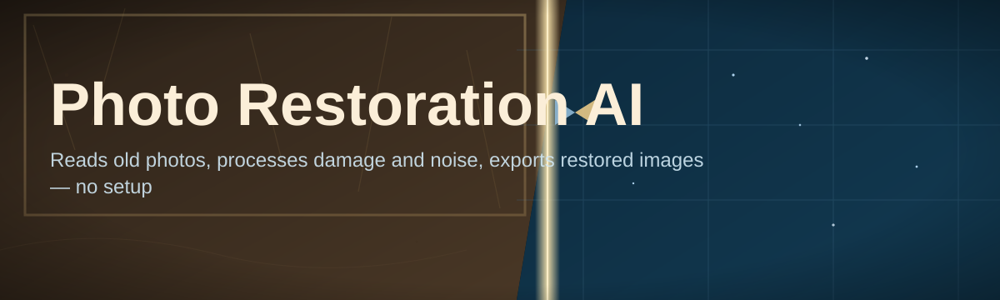
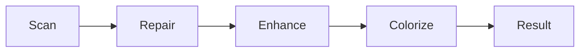

# photo-restoration-enhancer 🖼️✨

  

*Feed it a damaged memory. Get back a photograph.*

  

## 📷 Overview

Old photographs decay in predictable ways: silver halide fades, emulsion cracks, scanners introduce moiré, and decades of handling leave folds, foxing, and tears. **photo-restoration-enhancer** is a standalone Windows application that reverses that decay using a stack of purpose-built neural networks — face restoration, colorization, denoising, and upscaling — chained into a single click-and-wait workflow.

This exists because most "photo restoration AI" tools online are either cloud-locked, watermarked, or trained on generic datasets that flatten faces into plastic. This project runs entirely on your machine, keeps your originals untouched, and tunes each model stage specifically for scanned prints, film negatives, and old digital captures. No account, no upload queue, no compression artifacts baked in by a third-party server.

It's built for genealogists digitizing family archives, museums and local historians processing donated collections, and anyone staring at a shoebox of cracked prints wondering if the faces inside are recoverable. If your photo has a face, a horizon, or a signature, there's a good chance this tool can bring it back.

## 🚀 Get Started

## 🧩 What It Actually Does

| Capability | Detail |
|---|---|
| **Face Reconstruction** | Rebuilds eyes, mouths, and facial texture from blurred or degraded scans without turning people into strangers |
| **Scratch & Crease Removal** | Detects tears, fold lines, and dust specks, then inpaints them using surrounding pixel context |
| **Intelligent Colorization** | Adds plausible, era-aware color to black-and-white photos — skin tones, sky gradients, fabric hues |
| **Noise & Grain Suppression** | Strips scanner noise and film grain while preserving genuine texture, not smearing it into mush |
| **Resolution Upscaling** | Pushes low-res scans up to 4x with sharpened edges, no soft "AI blur" halo |
| **Batch Processing** | Load a folder, walk away, come back to hundreds of restored files |
| **Non-Destructive Pipeline** | Every edit writes to a new file — your original scan is never overwritten |
| **Offline Inference** | All models run locally on CPU or GPU — nothing leaves your machine |

> [!TIP]
> Run colorization *after* scratch removal, not before. Cleaning up damage first gives the color model a cleaner canvas and noticeably better results.

---

### Getting Running

1. Open the download page and grab the latest build for Windows.
2. Launch the executable — no installer wizard, no admin prompt required.
3. Drag a photo (or a folder) into the window.
4. Pick a restoration profile, hit **Run**, and export.

> [!NOTE]
> First launch takes longer while the app initializes its local model cache. Subsequent runs start almost instantly.

## 💻 System Requirements

- **OS:** Windows 10 or Windows 11 (64-bit)
- **RAM:** 8 GB minimum, 16 GB recommended for large batches
- **GPU:** Optional — NVIDIA GPU accelerates processing, but CPU-only mode works
- **Storage:** ~1.2 GB for the application and bundled models
- **Dependencies:** none — fully standalone, self-contained executable

  

## ⚙️ How It Works

The pipeline treats restoration as a sequence of specialist passes rather than one giant model trying to do everything at once. Each stage inspects the image, applies its correction, and hands off a cleaner version to the next.

1. **Ingest** — the photo is loaded and analyzed for damage type (scratches, fading, low resolution).
2. **Repair** — a segmentation-guided inpainting model fixes cracks, tears, and missing regions.
3. **Enhance** — face and detail networks sharpen texture without hallucinating new features.
4. **Colorize** *(optional)* — a diffusion-based colorization pass adds plausible hue and saturation.
5. **Export** — the final image is upscaled and written out in your chosen format.

> [!IMPORTANT]
> Colorization is a best-guess estimate, not historical fact. Always cross-check restored colors against family knowledge or documented records before treating them as accurate.

## 🧪 Troubleshooting

<strong>Restored faces look slightly "off" or waxy</strong>

Lower the face-enhancement strength slider. Aggressive settings over-smooth skin texture. A value around 40-60% usually preserves character while still fixing damage.

<strong>Colorization picked strange colors for clothing</strong>

The model infers color from context and lighting cues, not certainty. Use the manual color-hint tool to nudge specific regions toward known colors.

<strong>App runs slowly with no GPU detected</strong>

CPU-only inference is supported but slower on large batches. Reduce batch size or switch to the "Fast" quality profile for quicker turnaround.

<strong>Exported image looks over-sharpened</strong>

Dial back the upscaling strength in Settings → Output. The default profile favors detail recovery, which can read as harsh on already-sharp scans.

<strong>Batch job stopped partway through</strong>

Check the log panel — a single corrupted file can halt the queue. Remove the flagged file and resume; already-processed images are untouched.

> [!WARNING]
> Extremely low-resolution or heavily compressed source images (thumbnails, screenshots) will produce unreliable results — restoration quality is bounded by the information present in the original scan.

## 🎛️ Interface & Controls

The UI favors a dark workspace by default, with a light theme available for daylight editing sessions.

| Shortcut | Action |
|---|---|
| `Ctrl+O` | Open photo or folder |
| `Ctrl+S` | Export current result |
| `Ctrl+Z` | Undo last adjustment |
| `Space` | Toggle before/after preview |
| `Ctrl+B` | Run batch on loaded folder |
| `F1` | Open settings panel |

Settings persist between sessions, including your preferred quality profile, output format, and theme. A before/after slider overlay lets you drag across the image to compare original and restored regions directly.

## 🤝 Contributing & Community

> Bug reports, model feedback, and UI suggestions are welcome via Issues. If you've restored something remarkable, the community thread loves before/after posts.

- Open an issue for bugs — include OS version and a sample image if possible.
- Feature requests get triaged monthly; vote with a 👍 to bump priority.
- Pull requests should target a single change and include a clear description.

---

## 📜 License

Released under the [MIT License](LICENSE), 2026.

## ⚠️ Disclaimer

This tool generates plausible reconstructions of damaged photographs using machine learning — it does not recover objective ground truth. Restored details, especially colors and fine facial features, are estimates and should not be presented as verified historical fact. Use responsibly, especially with images depicting real, identifiable people.

